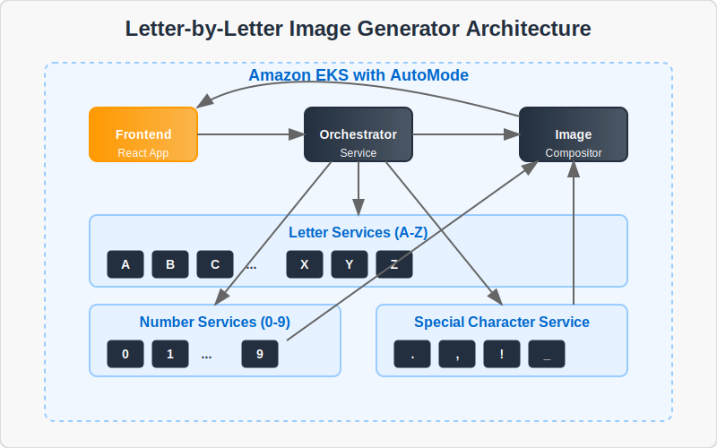

# Letter-by-Letter Image Generator for EKS AutoMode Demo

<div align="center">
  
</div>

## Project Overview

The Letter-by-Letter Image Generator is a cloud-native application designed to showcase Amazon EKS AutoMode capabilities through a microservices architecture. This application takes text input and generates stylized images by processing each character through dedicated microservices.

Each letter, number, and special character is handled by its own independent service, demonstrating how EKS AutoMode can efficiently manage and scale numerous microservices based on demand. The application highlights key cloud-native principles including:

- **Scalability**: Services scale independently based on their individual workloads
- **Resilience**: Failure in one character service doesn't affect the others
- **Resource Efficiency**: EKS AutoMode optimizes resource allocation automatically
- **Observability**: Built-in metrics and tracing for performance monitoring

This demo provides a practical example of how to structure, deploy, and manage complex microservice applications on Amazon EKS with AutoMode enabled.

## Architecture

<div align="center">
  
</div>

- **Frontend**: React application for user input and displaying results
- **Orchestrator Service**: Coordinates requests to letter/number services
- **Letter Services (A-Z)**: Generate images for each letter
- **Number Services (0-9)**: Generate images for each digit
- **Special Character Service**: Handles spaces, punctuation, etc.
- **Image Compositor Service**: Assembles the final image

## Development Stages

1. **First Iteration**: Frontend, Orchestrator, and Image Compositor with mocked letter services
2. **Second Iteration**: Implement actual letter, number, and special character services
3. **Third Iteration**: Add metrics, tracing, and visualization components
4. **Final Stage**: Deploy to EKS with AutoMode configuration

## Getting Started

Each component has its own directory with instructions for running locally:

- **frontend/**: React application for user interface
- **orchestrator-service/**: Service that coordinates requests
- **image-compositor-service/**: Service that assembles the final image
- **letter-services/**: Directory containing services for each letter
- **number-services/**: Directory containing services for each digit
- **special-char-service/**: Service for special characters

## Deployment

The application is deployed using AWS services:

- **Container Registry**: Images are stored in Amazon ECR
- **Kubernetes**: Services run on Amazon EKS with AutoMode
- **CI/CD**: Automated build and deployment configured in AWS console

## Local Development

To run the services locally:

1. Use the provided Makefile with podman:
   ```bash
   # Build and run all services
   make local
   
   # View running services
   make ps
   
   # View logs
   make logs
   
   # Stop all services
   make down
   ```

2. Alternatively, you can deploy to a local Kubernetes environment using podman:
   ```bash
   # Deploy to local Kubernetes
   make k8s-local
   
   # Remove local Kubernetes deployment
   make k8s-down
   ```

3. For individual service development, navigate to service directories and follow their README instructions

## Multi-Architecture Builds

The project supports building container images for both ARM64 and AMD64 architectures:

1. Build and push multi-architecture images to ECR:
   ```bash
   # Build and push images for both architectures
   make ecr-build-push-multi-arch
   ```

   This process:
   - Builds each service for both amd64 and arm64 architectures
   - Pushes architecture-specific tags to ECR
   - Creates and pushes manifest lists that work across architectures

2. Bump the version number when releasing new versions:
   ```bash
   # Update the version from 0.1.0 to 0.2.0
   make version-bump NEW_VERSION=0.2.0
   ```

The version is stored in the `VERSION` file at the root of the project.

## Contributing

Please see the CONTRIBUTING.md file for guidelines on how to contribute to this project.
